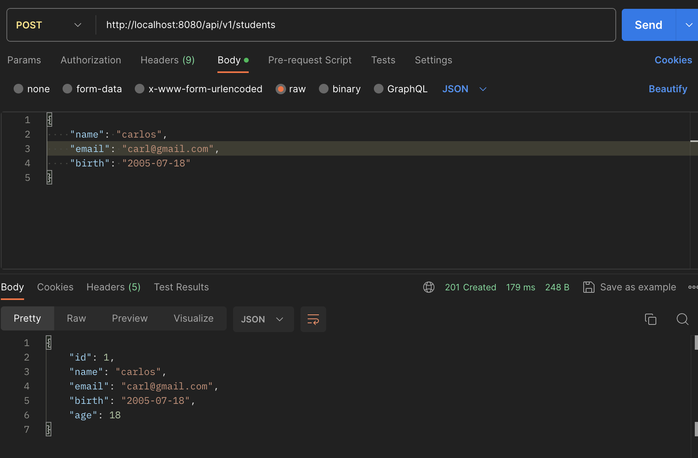
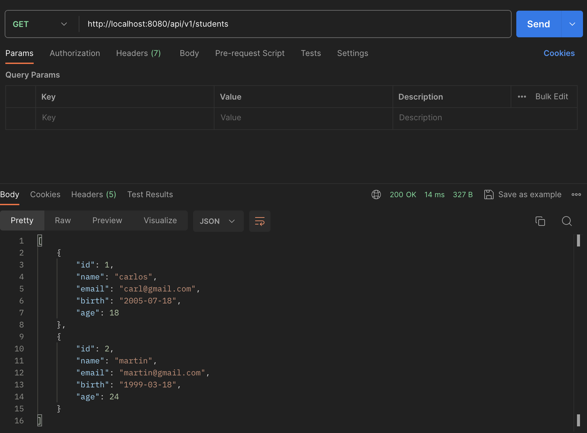
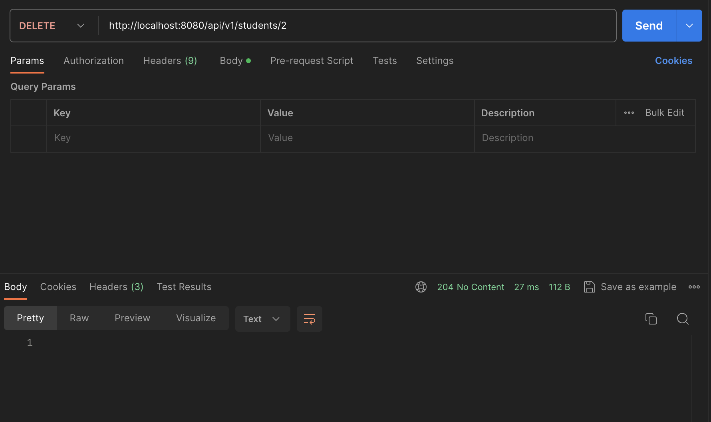
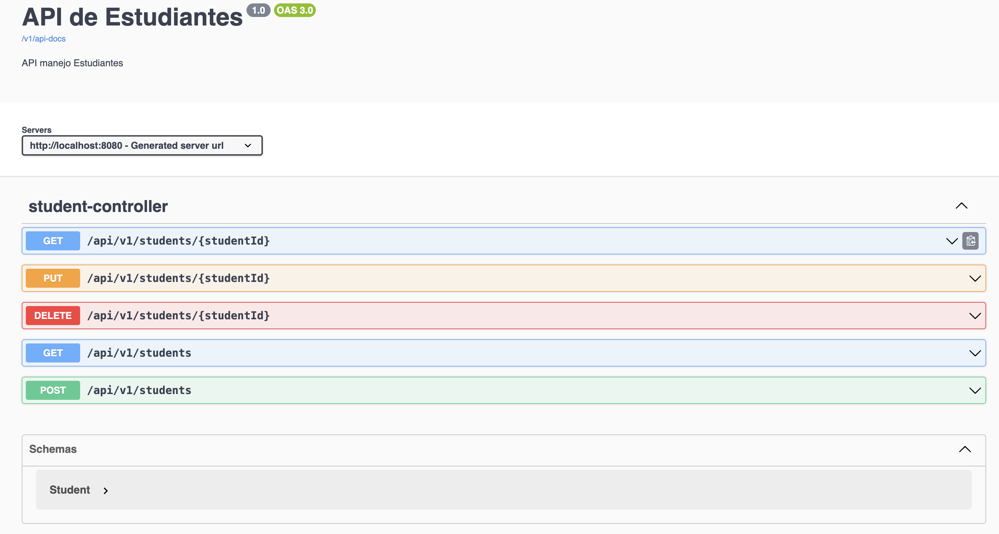

# SpringBoot - API REST
Este proyecto es una API REST realizada con Java y Spring Boot  que permite agregar, eliminar, actualizar y recuperar estudiantes de una base de datos PostgreSQL. Se utilizó Hibernate como ORM para el mapeo de objeto. Se aplicaron patrones de diseño como DAO e Inyección de dependencias.
Tambien se agregaron pruebas unitarias que se ejecutan contra una base de datos H2(in-memory-data base).

---

## Tecnologías utilizadas

- Java 17
- Spring Boot
- Spring Data
- JPA y Hibernate
- PostgreSQL
- Swagger/OpenAPI


## Instalación

### Configuración y ejecución

Para ejecutar el proyecto, primero necesitas tener instalado Java 17, Maven y PostgreSQL. 

### Clonar el repositorio
Luego debes clonar el repositorio, en la carpeta donde queres guardar el proyecto, usando el siguiente comando 
Clonar por HTTPS `git clone https://github.com/flosardo/SpringBootAPI.git`

Clonar por SSH `git clone git@github.com:flosardo/SpringBootAPI.git`

### Configuración de la base de datos
#### Base de datos de la app
En el archivo `application.properties` de la ruta src/main/resources/application.properties debes realizar los siguientes cambios:

a. `spring.datasource.url=jdbc:postgresql://localhost:5432/{nombre_de_tu_bd}`
b. `spring.datasource.username={usuario_de_tu_bd}`
c. `spring.datasource.password={contraseña_de_tu_bd}`

No es necesario realizar ninguna creación de la base de datos manualmente, ya que cuando se inicia la aplicación Hibernate crea la tabla con las respectivas columnas atomáticamente.

> [!Importante]
> Por defecto PostgreSQL corre en el puerto 5432. Si ya existe otra aplicación en dicho puerto, se deberá modifcar tambien el puerto en el archivo de propiedades.

#### Base de datos para los tests unitarios

Para ejecutar las pruebas unitarias, la base de datos H2 tiene que estar instalada y, si corresponde, se deberán realizar las siguientes modifcaciones en el archivo `application.properties` de la ruta src/test/resources/application.properties

a. `spring.datasource.h2.url=jdbc:h2://mem:{nombre_tu_bd};CLOSE_DELAY=-1;`
b. `spring.datasource.h2.username={usuario_de_tu_bd}`
c. `spring.datasource.h2.password={contraseña_de_tu_bd}`

> [!Importante]
> Por defecto el usuario de la base de datos H2 es`sa`y no tiene contraseña, tal como figura en el archivo.


### Ejecución de la aplicación

Una vez realizada la configuración de la base de datos e iniciada, se puede ejecutar la aplicación. Para eso busca la clase principal `"DemoApplication.java"` (con la anotación @SpringBootApplication) y apretá el botón run (ejecutar) de tu entorno de desarrollo.

A través de Postman o de la ruta donde se encuentran los metodos documentados (`http://localhost:8080/v1/api-docs/swagger-ui/index.html`) podrás probar cada uno de los endpoints, siguendo las instrucciones de esta misma documentación.
Por defecto, la app corre en el puerto 8080.

## Endpoints API


### Agregar un nuevo estudiante (C)

Para agregar un nuevo estudiante, realiza una petición **POST** a `api/v1/students` con el cuerpo de la petición conteniendo los detalles del estudiante. Se verifica que el email no esté en uso, caso contrario, se lanza una excepción.

```http
  POST localhost:8080/api/v1/students
```
| Parámetro | Tipo     | Descripción              | Ejemplo|
| :-------- | :------- | :------------------------- | :------------------------- |
| name| `String` | **Requerido** por body  |Carlos
| email| `String` | **Requerido** por body|carl@gmail.com
| birth(yy-mm-d)| `String` | **Requerido** por body| 2005-07-10
- URL: `localhost:8080/api/v1/students`
- Método: POST
- Ejemplo de respuesta:

  201 - CREATED: id, name, email, birth, age (auto-calculada)



### Obtener todos los estudiantes (R)

Para obtener todos los estudiantes se realiza una petición **GET** a `api/v1/students`.
```http
  GET localhost:8080/api/v1/students
```
- URL: `localhost:8080/api/v1/students`
- Método: GET
- Ejemplo de respuesta
  200 - OK: Retorna un objeto JSON con los estudiantes existentes, de no existir ninguno devuleve un array vacío.



### Obtener un estudiante (R)

Para obtener los detalles de un estudiante en particular, se debe hacer una petición **GET** a `api/v1/students/{id}`, donde `{id}` es el ID del estudiante.


```http
  GET localhost:8080/api/v1/students/2
```

- URL: `localhost:8080/api/v1/students/{id}`
- Método: GET
- Ejemplo de respuesta:
  200 - OK: id, name, email, birth, age (auto-calculada)


### Actualizar un estudiante (U)

Para actualizar un estudiante (nombre y/o email), se debe hacer una petición **PUT** a `api/v1/students/{id}`, donde `{id}` es el ID del estudiante a modificar. Si se desea actualizar el email por uno que ya esta en uso por otro usuario se lanza una excepción. 
**La petición debe contener alguno de los dos parametros para actualizar al estudiante**.

```http
  PUT localhost:8080/api/v1/students/1
```

| Parámetro | Tipo     | Descripción              | Ejemplo|
| :-------- | :------- | :------------------------- | :------------------------- |
| name| `String` | **Opcional** para la URL  |robertito
| email| `String` | **Opcional** para la URL  |tito90@gmail.com

- URL: `localhost:8080/api/v1/students/1?name={valor}&email={valor}`
- Método: POST
- Ejemplo de respuesta:
  200 - OK


### Eliminar un estudiante (D)

Para eliminar un estudiante, se debe hacer una petición **DELETE** a `api/v1/students/{id}`, donde `{id}` es el ID del estudiante.

```http
  DELETE localhost:8080/api/v1/students/2
```

- URL: `localhost:8080/api/v1/students/{id}`
- Método: DELETE
- Ejemplo de respuesta
  204 - No Content



## Documentación de la API

Adicionalmente, la documentación de la API está disponible en `http://localhost:8080/v1/api-docs/swagger-ui/index.html` y se puede probar cada uno de los métodos.


